# 📦 Teknik Servis ERP Otomasyonu

Bu proje, teknik servis süreçlerini dijital olarak yönetmek ve izlemek amacıyla geliştirilmiş bir masaüstü otomasyon uygulamasıdır. C# dili ve .NET Framework kullanılarak geliştirilmiştir.

---

## 🛠 Özellikler

- 📋 Ürün kabul işlemleri (müşteri, seri no, giriş-çıkış tarihi vb.)
- 👨‍🔧 Personel ve müşteri yönetimi
- 🔍 Ürün arıza takibi, açıklamaları ve durum güncellemeleri
- 🧾 Fatura işlemleri, geçmiş sorgulama ve PDF çıktısı alma
- 📊 İstatistiksel analizler, rapor sihirbazı
- 🧰 Hesap makinesi, döviz kuru, not defteri gibi yardımcı araçlar
- ✉️ SMS ve e-posta iletişim modülü

---

## 💻 Kullanılan Teknolojiler

| Teknoloji           | Açıklama                     |
|---------------------|------------------------------|
| C#                  | Ana yazılım dili             |
| WinForms            | Kullanıcı arayüzü oluşturma  |
| .NET Framework      | Uygulama altyapısı (.NET 4.x)|
| Microsoft SQL Server | Veritabanı yönetimi          |
| Visual Studio       | Geliştirme ortamı            |

---

## 🖼 Ekran Görüntüleri

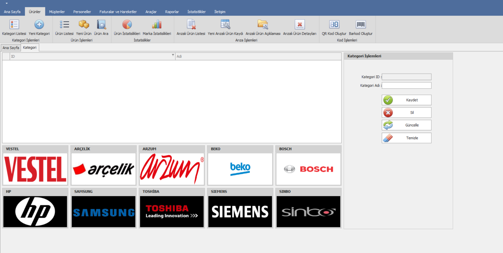  
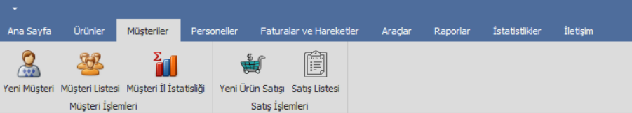  
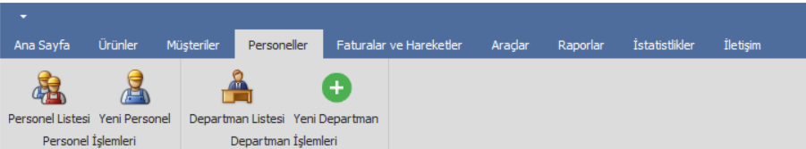  
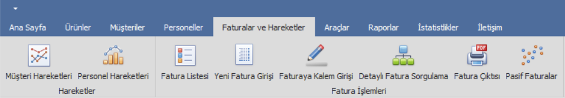  
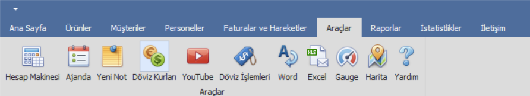  
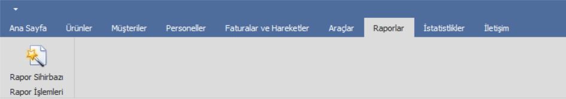  
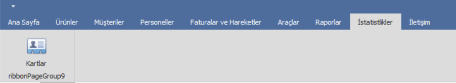  
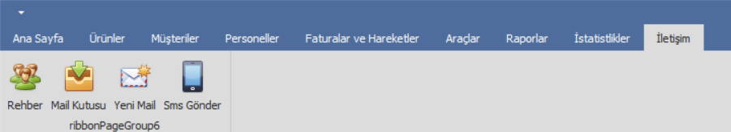  
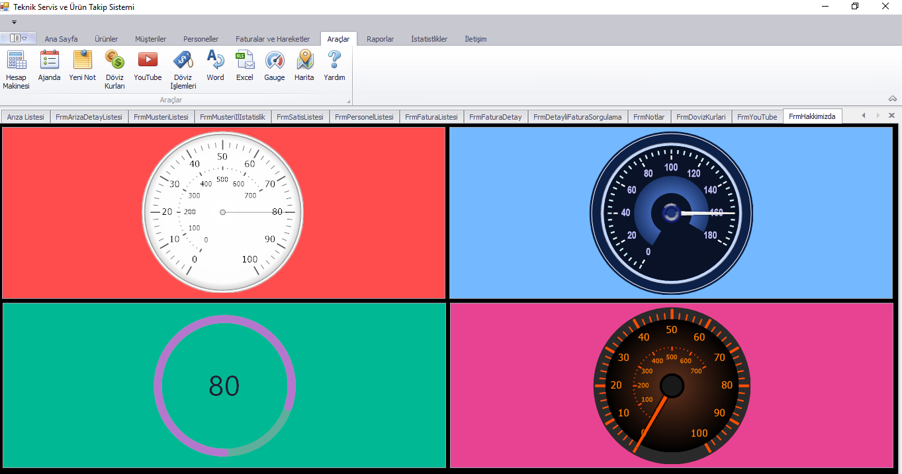  
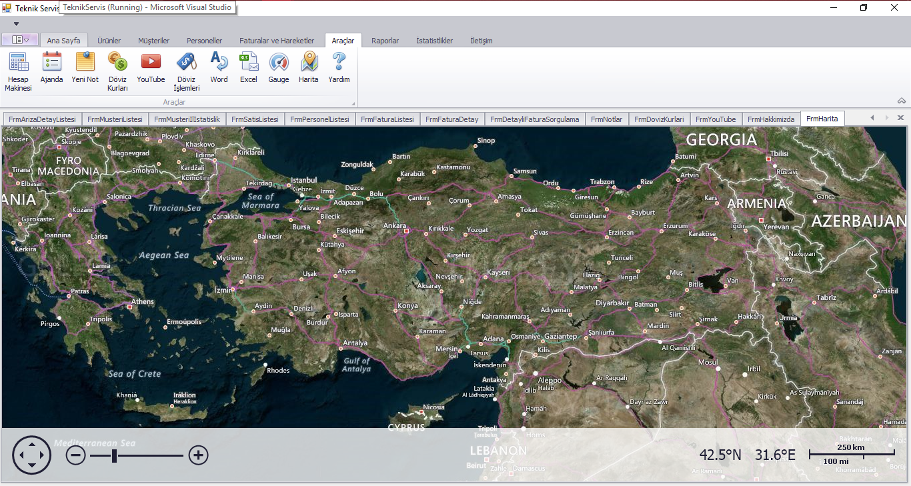  
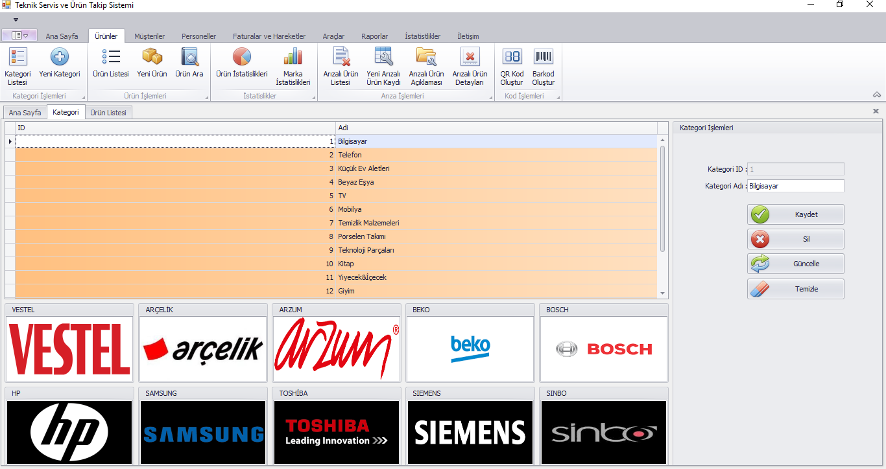  
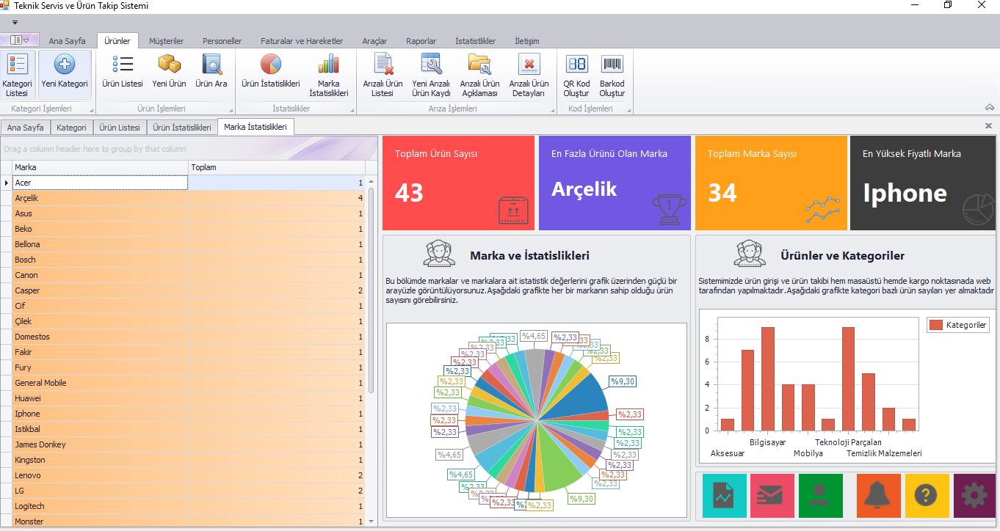  
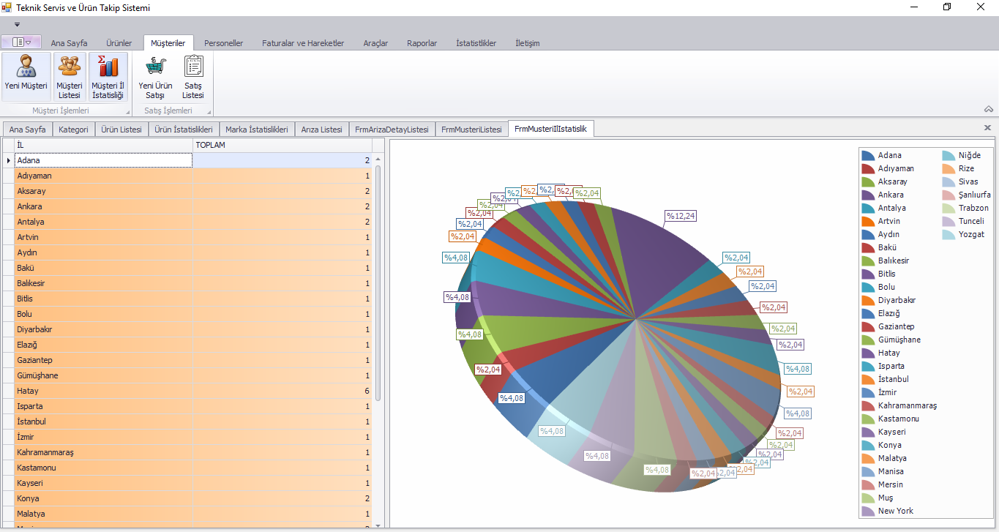  
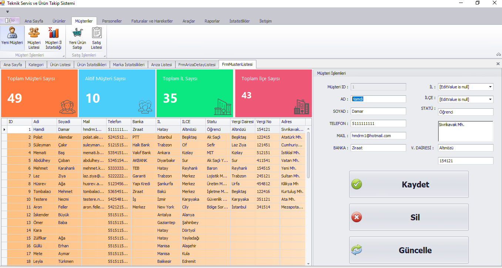  
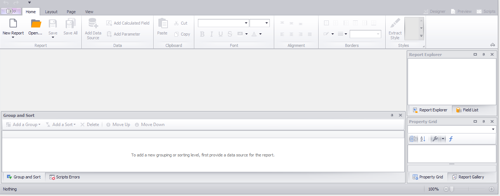  
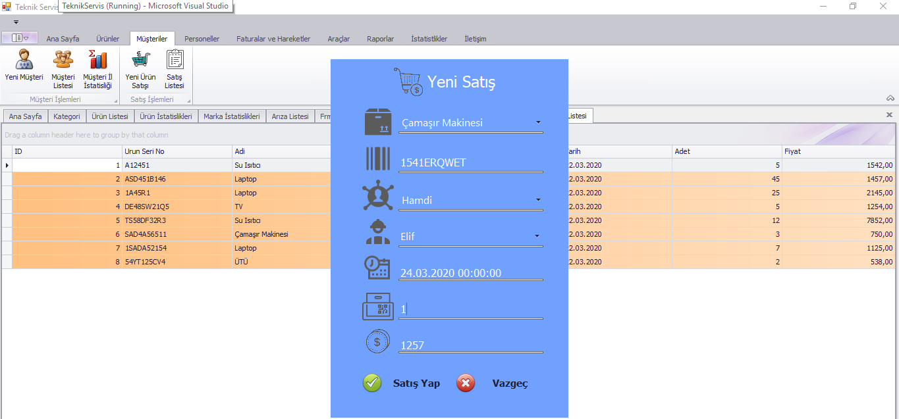  
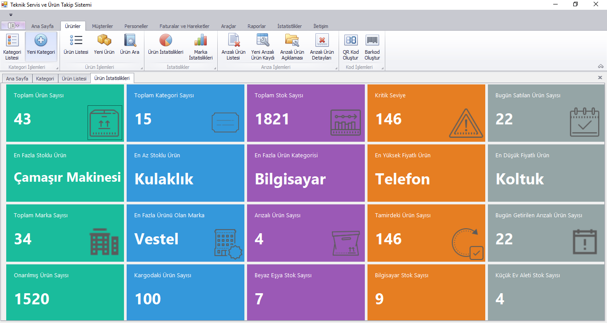  
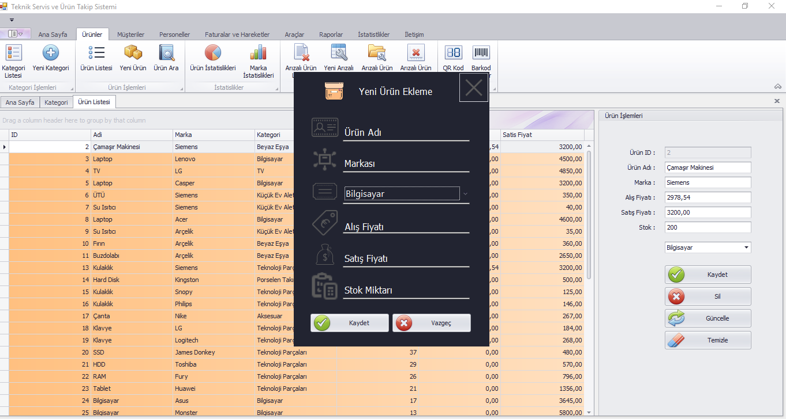  
  

---

## 🚀 Kurulum ve Kullanım

1. Visual Studio ile projeyi açın.  
2. `app.config` dosyasındaki SQL bağlantı cümlesini güncelleyin.  
3. SQL Server’da gerekli tabloları ve veritabanını oluşturun.  
4. Projeyi çalıştırın ve arayüzden işlem yapmaya başlayın.  

---

## 👨‍💻 Geliştirici Notları

- Kodlama standartlarına ve katmanlı mimariye uygun geliştirilmiştir.  
- Validasyon ve hata önleyici kontroller uygulanmıştır.  
- Kullanıcı dostu arayüz ve sade menü tasarımı tercih edilmiştir.  
